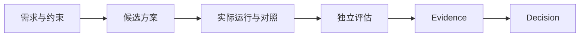
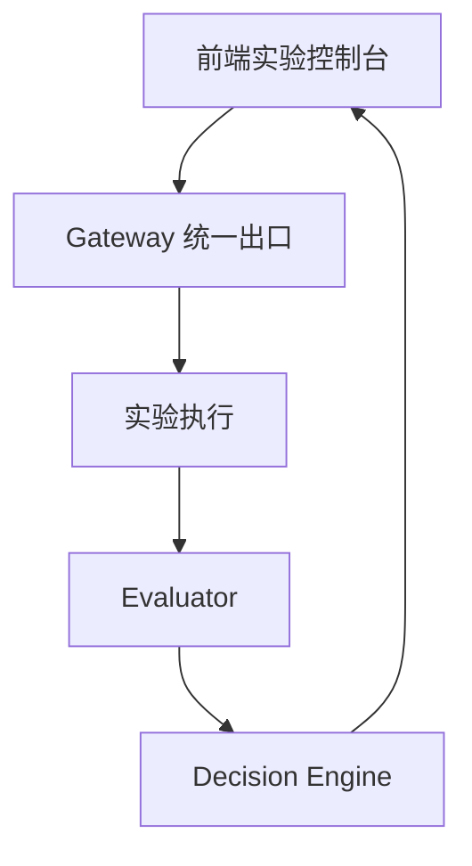
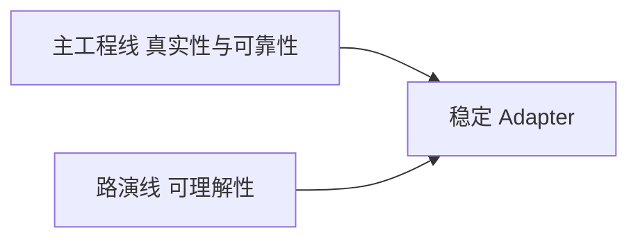
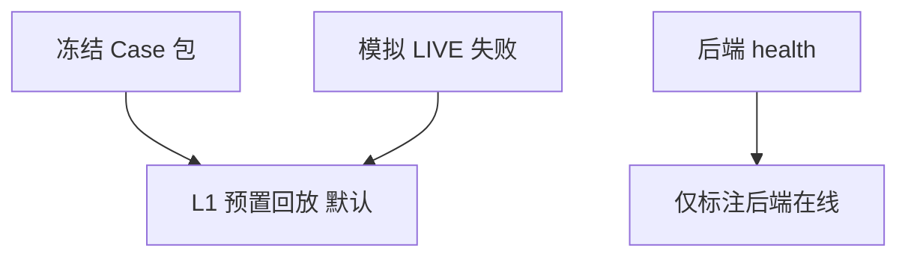

# 路演架构与流程节点｜ARCHITECTURE

> 供 draw.io / Figma / PPT 使用。节点文字已冻结。不要往图里写 SHA、Prompt Gate、`tc_` / `ta_`、内网地址。

---

## 一、产品总流程

节点说明：

| 节点 | 对评委说 |
| --- | --- |
| 需求与约束 | 要证明什么，以及本次不证明什么 |
| 候选方案 | 系统路径 vs 错误外推 Baseline |
| 实际运行与对照 | 不是一次聊天，是对照实验 |
| 独立评估 | 执行方不能自己宣布成功 |
| Evidence | 可复核摘要；缺口也要可见 |
| Decision | 受控试运行 / 暂缓 / 证据不足 / 人工辅助 / 安全阻断 |

---

## 二、系统架构（对外）

| 节点 | 职责 |
| --- | --- |
| 前端实验控制台 | 展示层 ViewModel；Mock/Replay Adapter；角标诚实 |
| Gateway 统一出口 | 模型 / 工具 / 知识库调用可观测 |
| 实验执行 | 产出结构化运行结果 |
| Evaluator | 证据不足则 fail-closed |
| Decision Engine | 输出冻结档位，不外推未证明项 |

并行说明（可选配图，P1）：

---

## 三、演示模式（不要画成「假 LIVE」）

L0 真实运行只有在 RealApiAdapter 跑出与 LIVE-1R 一致的 `SUPPORT_CONTROLLED_TRIAL` 后才允许作为角标。health 200 不够。
